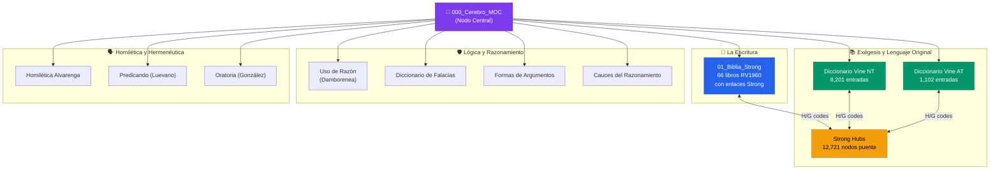

<div align="center">

# 🧠 Neurona Bíblica

### Un Zettelkasten Teológico de Nivel Profesional

<div align="center">
  <p>
    
    
    
  </p>
  <p>
    
  </p>
</div>

---

**Neurona Bíblica** es un ecosistema de conocimiento personal (*Second Brain*) construido sobre [Obsidian](https://obsidian.md), diseñado para la exégesis bíblica rigurosa, la preparación de sermones con integridad lógica y el estudio profundo de las Escrituras en sus idiomas originales.

A diferencia de una simple colección de notas, este repositorio es una **red neuronal de conocimiento interconectado**: cada versículo bíblico está algorítmicamente enlazado a sus raíces originales en hebreo y griego, cada definición del diccionario apunta de vuelta a los versículos que la usan, y todo el arsenal de lógica y retórica está disponible para auditar y fortalecer cualquier argumento teológico.

</div>

---

## 📐 Arquitectura del Sistema



### ¿Cómo funciona la interconexión?

El corazón de la arquitectura es el sistema de **Nodos Puente Strong**. Funciona así:

1. **La Biblia** (RV1960) fue procesada algorítmicamente. Cada palabra con referencia Strong (ej. *"Dios"* → `H430`) fue convertida en un enlace activo `[[H430]]`.
2. **Los Diccionarios Vine** (Antiguo y Nuevo Testamento) contienen definiciones exhaustivas de las palabras originales. Cada código Strong mencionado en sus definiciones también fue convertido en un enlace `[[H430]]`.
3. **Los Nodos Puente** (`Strong_Hubs/H430.md`) son archivos minimalistas que existen únicamente como *intersecciones de tráfico*. Cuando los abres en Obsidian, la pestaña de **Backlinks** te muestra automáticamente:
   - ✅ Todos los versículos de la Biblia que usan esa raíz.
   - ✅ Todas las definiciones del Diccionario Vine que explican esa raíz.
   - ✅ Cualquier sermón o estudio que haga referencia a ella.

> **Resultado:** Al leer Génesis 1:1 y hacer clic en `[[H430]]` (la palabra *Elohim*), Obsidian te conecta *instantáneamente* con cada aparición de "Dios" en toda la Biblia y con su definición completa en el diccionario exegético. Sin búsquedas manuales. Sin concordancias externas. Todo vive dentro del grafo.

---

## 🏛️ Los Cinco Pilares

### 📖 Pilar I — La Sagrada Escritura

| Elemento | Detalle |
|---|---|
| **Fuente** | Reina-Valera 1960 con números Strong |
| **Formato** | 66 archivos Markdown (uno por libro) |
| **Ubicación** | `01_Biblia_Strong/` |
| **Índice** | `Indice_Biblico_Maestro.md` |
| **Característica clave** | Cada palabra con raíz original está enlazada a su Strong Hub |

### 📚 Pilar II — Exégesis y Lenguaje Original

| Elemento | Detalle |
|---|---|
| **Fuente** | Diccionario Expositivo Vine (AT + NT) |
| **Formato** | 9,303 archivos atómicos (una entrada por archivo) |
| **Strong Hubs** | 12,721 nodos puente (H0001–H8674 hebreo, G0001–G5624 griego) |
| **Ubicación** | `00_Diccionarios/` |
| **Característica clave** | Fragmentación atómica: cada definición es un nodo independiente enlazado bidireccionalmente al texto bíblico |

### 🛡️ Pilar III — Lógica y Razonamiento

| Obra | Archivos | Ubicación |
|---|---|---|
| **Uso de Razón** (Ricardo García Damborenea) | 16 partes | `04_Logica_y_Razonamiento/Uso_De_Razon/` |
| **Diccionario de Falacias** (Damborenea) | 9 partes | `04_Logica_y_Razonamiento/Diccionario_Falacias/` |
| **Formas de Argumentos** (Damborenea) | 5 partes | `04_Logica_y_Razonamiento/Formas_de_Argumentos/` |
| **Cauces del Razonamiento** (Damborenea) | 5 partes | `04_Logica_y_Razonamiento/Cauces_del_Razonamiento/` |
| **Razonando Correctamente** (Willie Alvarenga) | 8 partes | `04_Logica_y_Razonamiento/Razonando_Correctamente/` |

> Este pilar proporciona las herramientas para **detectar falacias**, construir **argumentos válidos** y auditar la solidez lógica de cualquier sermón o estudio bíblico.

### 🗣️ Pilar IV — Homilética y Hermenéutica

| Obra | Ubicación |
|---|---|
| **Homilética** (Willie Alvarenga) | `05_Homiletica_y_Oratoria/Homiletica_Alvarenga/` |
| **Predicando la Palabra de Dios** (Luevano) | `05_Homiletica_y_Oratoria/Homiletica_Luevano/` |
| **Oratoria** (Israel González) | `05_Homiletica_y_Oratoria/Oratoria_Israel_Gonzalez/` |

> Este pilar enseña el *arte* de transformar el estudio exegético en un mensaje predicable, con estructura, claridad y poder persuasivo.

### 💡 Pilar V — Exégesis Aplicada y Doctrina

| Elemento | Ubicación |
|---|---|
| **Comentario al NT** (Partain-Reeves) | `02_Exegesis/Comentario_Partain_Reeves/` |
| **La Iglesia del Nuevo Testamento** (Cogdill) | `07_Doctrinas/La_Iglesia_Del_Nuevo_Testamento/` |
| **Interrogantes y Respuestas** (Reeves) | `08_Preguntas_y_Respuestas/Interrogantes_y_Respuestas/` |
| **Música Instrumental y Adoración** (James D. Bales) | `05_Materiales/Bales_Musica_Instrumental/` |
| **Notas Sobre Daniel** (Bill H. Reeves) | `02_Exegesis/Notas_Sobre_Daniel_Reeves/` |
| **Isaías** (Robert Harkrider) | `02_Exegesis/Isaias_Harkrider/` |
| **Ezequiel** (Harkrider & Hernandez) | `02_Exegesis/Ezequiel_Harkrider/` |

> Este pilar provee explicaciones versículo por versículo del Nuevo Testamento y material doctrinal para resolver dudas frecuentes y entender la estructura eclesiástica.

---

## 📂 Estructura de Carpetas

```
NeuronaBiblica/
├── 000_Cerebro_MOC.md            # 🧠 Nodo central (Map of Content)
├── Reporte_Arquitecto.md         # 📊 Diagnóstico de salud del grafo
│
├── 00_Conceptos/                 # Nodos atómicos de conceptos teológicos
├── 00_Diccionarios/              # ══════════════════════════════════════
│   ├── Diccionario_Vine_NT/      #   8,201 definiciones (Nuevo Testamento)
│   ├── Diccionario_Vine_AT/      #   1,102 definiciones (Antiguo Testamento)
│   ├── Strong_Hubs/              #   12,721 nodos puente (raíces H/G)
│   └── Diccionario_Homiletico.md #   Glosario de términos homiléticos
│
├── 00_Indices/                   # Índices temáticos y generales
├── 00_Inbox_Materiales_Nuevos/   # Buzón de entrada para nuevos PDFs
│
├── 01_Biblia_Strong/             # 66 libros RV1960 con Strong interconectado
├── 01_Biblias/                   # Otras versiones bíblicas de referencia
│
├── 02_Exegesis/                  # Estudios exegéticos específicos
├── 03_Hermeneutica/              # Reglas de interpretación bíblica
├── 04_Logica_y_Razonamiento/     # Lógica, falacias y argumentación
├── 05_Homiletica_y_Oratoria/     # Arte de predicar y comunicar
├── 05_Materiales/                # Estudios doctrinales procesados
│
├── 06_Sermones_Generados/        # 📝 Producto final: sermones y bosquejos
├── 07_Doctrinas/                 # Nodos doctrinales transversales
├── 08_Preguntas_y_Respuestas/    # Apologética y resolución de dudas
├── 99_Plantillas/                # Templates para nuevos documentos
│
└── scripts/                      # 🔧 ETL: scripts Python de procesamiento
```

---

## 🔧 Pipeline de Procesamiento (ETL)

Todo el contenido fue procesado algorítmicamente con scripts Python especializados:

| Script | Función |
|---|---|
| `procesar_biblia_strong.py` | Extrae la Biblia `.bblx` (SQLite), limpia RTF, fragmenta en 66 libros y enlaza códigos Strong |
| `procesar_vine.py` | Extrae los diccionarios `.dctx` (SQLite), limpia RTF y genera 9,303 archivos atómicos |
| `enlazar_vine_strong.py` | Inyecta enlaces `[[H/G]]` retroactivamente en los archivos Vine ya generados |
| `procesar_diccionario_falacias.py` | Procesa PDFs de lógica con PyMuPDF y genera fragmentos Markdown |

> **Nota técnica:** Los archivos `.bblx` y `.dctx` son bases de datos SQLite utilizadas por la aplicación móvil MySword. Los campos de texto contienen formato RTF embebido que fue limpiado con la librería `striprtf`.

---

## 🚀 Cómo Usar

### Requisitos
- [Obsidian](https://obsidian.md) (gratuito, multiplataforma)

### Instalación
1. Clona este repositorio:
   ```bash
   git clone https://github.com/tu-usuario/NeuronaBiblica.git
   ```
2. Abre Obsidian → **Open folder as vault** → selecciona la carpeta `NeuronaBiblica/`.
3. Navega al nodo central: `000_Cerebro_MOC.md`.

### Flujo de Trabajo Recomendado
1. **Estudiar un pasaje**: Abre cualquier libro en `01_Biblia_Strong/`. Haz clic en los códigos Strong para explorar las raíces originales.
2. **Profundizar en una palabra**: Al hacer clic en un Strong Hub, revisa los Backlinks para ver todas las apariciones bíblicas y definiciones Vine.
3. **Auditar un argumento**: Consulta `04_Logica_y_Razonamiento/` para verificar la validez lógica de una interpretación.
4. **Preparar un sermón**: Usa `05_Homiletica_y_Oratoria/` para estructurar y comunicar tus hallazgos.

---

## 📊 Métricas del Grafo

| Métrica | Valor |
|---|---|
| Total de Nodos | **49,275** |
| Total de Sinapsis (enlaces) | **~357,000** |
| Nodos con ≥5 conexiones | **13,019** (creciendo con SOC) |
| Cohesión del grafo | **98.6%** |
| Hubs Maestros SOC | **98** |
| Nodos Puente Strong | **12,721** |
| Entradas de Diccionario | **9,303** |
| Libros Bíblicos | **66** |
| Conceptos Teológicos | **149** (pendientes de desarrollo) |

---

## 📜 Licencia y Uso

Este repositorio es un proyecto personal de estudio bíblico. Los textos procesados provienen de obras de dominio público o de uso educativo. Los scripts de procesamiento son de autoría propia.

---

## 👤 Autor

**Luis Felipe Torres Muñoz**
*Un Cristiano, Ingeniero y Contador amante de la Palabra de Dios.*

📧 **Contacto:** [lfelipetorresm@hotmail.com](mailto:lfelipetorresm@hotmail.com)
📱 **Cel.:** +57 (316) 730 4014

---

## 💛 Apoya este Proyecto

Este proyecto está en **constante crecimiento**. Si deseas hacer una donación para animar y sostener su desarrollo, ¡sería de gran bendición!

📩 **Escríbeme un correo a [lfelipetorresm@hotmail.com](mailto:lfelipetorresm@hotmail.com) si deseas contribuir.**

> *"Cada uno dé como propuso en su corazón: no con tristeza, ni por necesidad, porque Dios ama al dador alegre."*
> — **2 Corintios 9:7** (RV1960)

---

<div align="center">

*"Escudriñad las Escrituras; porque a vosotros os parece que en ellas tenéis la vida eterna; y ellas son las que dan testimonio de mí."*
— **Juan 5:39** (RV1960)

---

Construido con 🧠 y ❤️ para la gloria de Dios.

</div>

